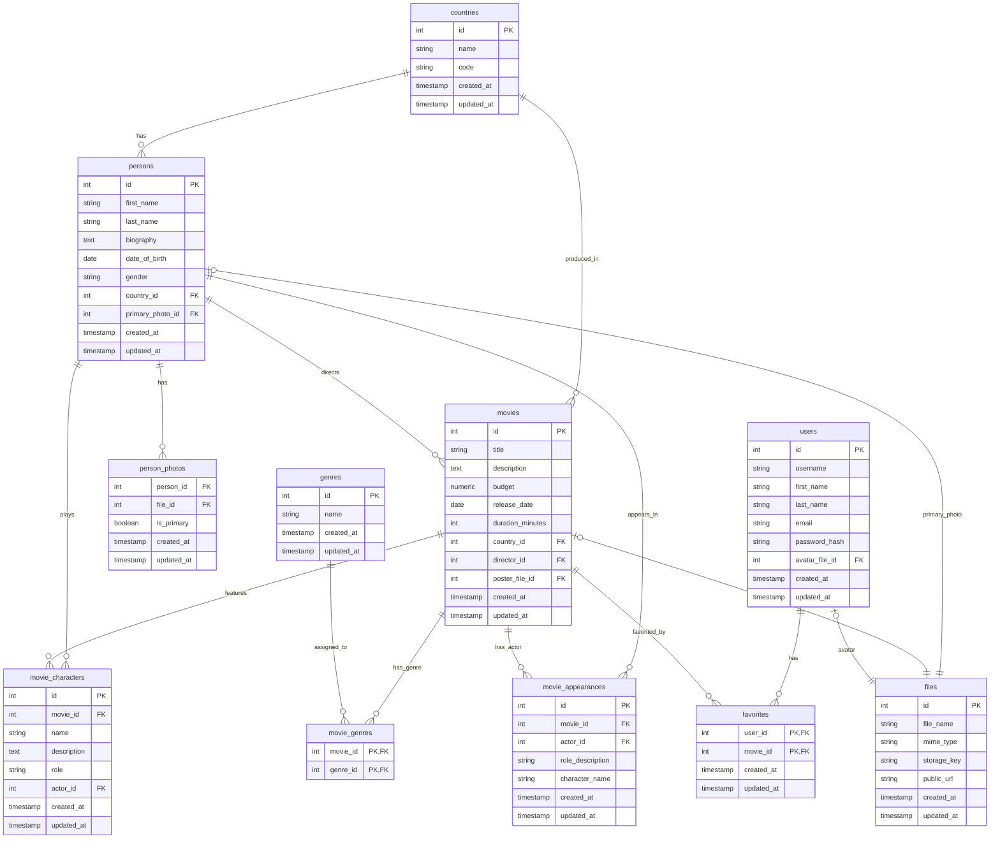

# Movie Database

Database design for a movie application.

## ER Diagram

```mermaid
erDiagram
    countries ||--o{ persons : "has"
    countries ||--o{ movies : "produced_in"
    persons ||--o{ movies : "directs"
    persons ||--o{ movie_characters : "plays"
    persons ||--o{ movie_appearances : "appears_in"
    persons |o--|| files : "primary_photo"
    persons ||--o{ person_photos : "has"
    movies ||--o{ movie_genres : "has_genre"
    genres ||--o{ movie_genres : "assigned_to"
    movies ||--o{ movie_characters : "features"
    movies ||--o{ movie_appearances : "has_actor"
    movies |o--|| files : "poster"
    users ||--o{ favorites : "has"
    movies ||--o{ favorites : "favorited_by"
    users |o--|| files : "avatar"

    countries {
        int id PK
        string name
        string code
        timestamp created_at
        timestamp updated_at
    }

    genres {
        int id PK
        string name
        timestamp created_at
        timestamp updated_at
    }

    files {
        int id PK
        string file_name
        string mime_type
        string storage_key
        string public_url
        timestamp created_at
        timestamp updated_at
    }

    persons {
        int id PK
        string first_name
        string last_name
        text biography
        date date_of_birth
        string gender
        int country_id FK
        int primary_photo_id FK
        timestamp created_at
        timestamp updated_at
    }

    person_photos {
        int person_id FK
        int file_id FK
        boolean is_primary
        timestamp created_at
        timestamp updated_at
    }

    movies {
        int id PK
        string title
        text description
        numeric budget
        date release_date
        int duration_minutes
        int country_id FK
        int director_id FK
        int poster_file_id FK
        timestamp created_at
        timestamp updated_at
    }

    movie_genres {
        int movie_id PK, FK
        int genre_id PK, FK
    }

    movie_characters {
        int id PK
        int movie_id FK
        string name
        text description
        string role
        int actor_id FK
        timestamp created_at
        timestamp updated_at
    }

    movie_appearances {
        int id PK
        int movie_id FK
        int actor_id FK
        string role_description
        string character_name
        timestamp created_at
        timestamp updated_at
    }

    users {
        int id PK
        string username
        string first_name
        string last_name
        string email
        string password_hash
        int avatar_file_id FK
        timestamp created_at
        timestamp updated_at
    }

    favorites {
        int user_id PK, FK
        int movie_id PK, FK
        timestamp created_at
        timestamp updated_at
    }
```
